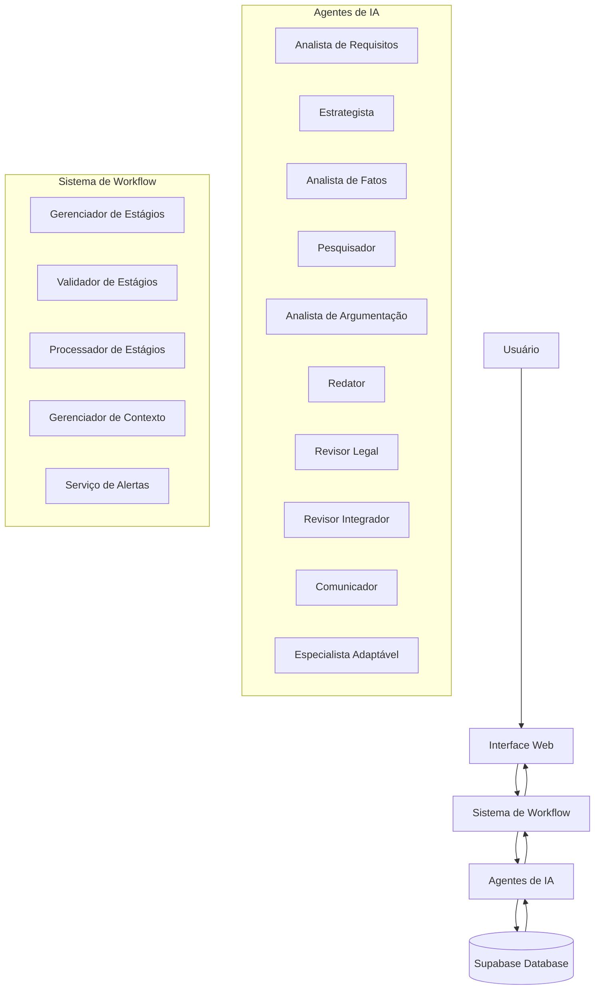

# EVJI - Arquitetura do Sistema

## Visão Geral

O EVJI (Escritório Virtual Jurídico Inteligente) é uma plataforma que estende as capacidades de profissionais jurídicos através de automação e agentes de IA. O sistema processa casos jurídicos de forma semi-autônoma, mantendo o profissional no controle final das decisões.

A arquitetura do EVJI é baseada em um sistema de múltiplos agentes coordenados por um fluxo de trabalho (workflow) estruturado. Cada agente tem uma função específica dentro do processo jurídico, desde a recepção de documentos até a entrega final ao cliente.

## Arquitetura de Componentes

### Interface do Usuário (Frontend)
- **Tecnologias**: React, TypeScript, Tailwind CSS, Shadcn/UI
- **Responsabilidades**: Oferecer uma interface intuitiva para os usuários interagirem com o sistema, gerenciar casos, visualizar documentos e acompanhar o progresso do fluxo de trabalho.
- **Componentes Principais**: Dashboard, Gerenciamento de Casos, Visualização de Documentos, Chat com Agentes

### Backend
- **Tecnologias**: Supabase (PostgreSQL, Authentication, Storage), Edge Functions
- **Responsabilidades**: Armazenamento de dados, autenticação de usuários, gerenciamento de arquivos, processamento de tarefas assíncronas.

### Sistema de Workflow
- **Responsabilidades**: Orquestrar o fluxo de trabalho dos casos, coordenar a execução dos agentes, validar a conclusão de etapas.
- **Componentes Principais**:
  - **Gerenciador de Estágios**: Inicializa, atualiza e rastreia os estágios do workflow.
  - **Validador de Estágios**: Verifica se os requisitos para avançar de estágio foram cumpridos.
  - **Processador de Estágios**: Executa a lógica de transição entre estágios.
  - **Gerenciador de Contexto**: Mantém o contexto do caso ao longo do workflow.
  - **Serviço de Alertas**: Gera alertas para situações que requerem atenção do usuário.

## Agentes de IA

### 1. Analista de Requisitos e Triagem
- **Função**: Receber documentos, classificar casos, extrair informações iniciais, gerar briefing.
- **Implementação**: `src/agents/AnalistaRequisitosAgent.ts`
- **Fluxo de Dados**: Recebe documentos do usuário → Extrai metadados → Armazena no Supabase → Ativa o próximo estágio.

### 2. Estrategista Jurídico
- **Função**: Analisar viabilidade do caso, definir objetivos, mapear riscos, criar plano estratégico.
- **Implementação**: `src/agents/EstrategistaAgent.ts`
- **Fluxo de Dados**: Usa análise inicial → Define estratégia → Atualiza banco de dados → Aciona Analista de Fatos.

### 3. Analista de Fatos
- **Função**: Extrair cronologia de eventos, identificar fatos relevantes, classificar fatos controvertidos/incontroversos.
- **Implementação**: `src/agents/AnalistaFatosAgent.ts`
- **Fluxo de Dados**: Recebe documentos e estratégia → Extrai e classifica fatos → Armazena resultados → Aciona Pesquisador.

### 4. Pesquisador Jurídico
- **Função**: Buscar legislação aplicável, jurisprudência relevante, doutrina especializada.
- **Implementação**: `src/agents/PesquisadorAgent.ts`
- **Fluxo de Dados**: Usa fatos e questões jurídicas → Pesquisa fontes → Compila resultados → Alimenta Analista de Argumentação.

### 5. Analista de Argumentação
- **Função**: Estruturar argumentos, avaliar premissas, identificar contra-argumentos.
- **Implementação**: `src/agents/AnalistaArgumentacaoAgent.ts`
- **Fluxo de Dados**: Usa pesquisa e fatos → Constrói argumentos → Armazena no contexto → Aciona Redator.

### 6. Especialista Adaptável
- **Função**: Analisar camadas avançadas (constitucional, internacional), realizar análises interdisciplinares.
- **Implementação**: `src/agents/EspecialistaAdaptavelAgent.ts`
- **Fluxo de Dados**: Recebe análises anteriores → Aprofunda questões complexas → Complementa argumentação.

### 7. Redator Jurídico
- **Função**: Estruturar documento, redigir fundamentação, formular pedidos.
- **Implementação**: `src/agents/RedatorAgent.ts`
- **Fluxo de Dados**: Usa argumentos e pesquisa → Compõe documento → Gera minuta → Aciona Revisor.

### 8. Assistente de Redação
- **Função**: Auxiliar na estruturação e formatação de documentos.
- **Implementação**: `src/agents/AssistenteRedacaoAgent.ts`
- **Fluxo de Dados**: Colabora com o Redator → Aprimora estrutura do documento.

### 9. Revisor Legal
- **Função**: Verificar requisitos formais, conformidade legal, referências, coerência estratégica.
- **Implementação**: `src/agents/RevisorLegalAgent.ts`
- **Fluxo de Dados**: Recebe documento → Verifica conformidade → Indica correções → Aciona Revisor Integrador.

### 10. Revisor Integrador
- **Função**: Revisão final, integração de elementos, garantia de coesão.
- **Implementação**: `src/agents/RevisorIntegradorAgent.ts`
- **Fluxo de Dados**: Recebe revisão legal → Finaliza documento → Prepara para entrega.

### 11. Comunicador com Cliente
- **Função**: Preparar comunicação ao cliente, traduzir termos técnicos, antecipar dúvidas.
- **Implementação**: `src/agents/ComunicadorAgent.ts`
- **Fluxo de Dados**: Recebe documento final → Prepara resumo executivo → Cria material para cliente.

## Fluxo de Trabalho (Workflow)

O workflow do EVJI segue um processo estruturado em estágios, onde cada estágio corresponde a uma etapa do trabalho jurídico:

### 1. Recepção e Triagem
- **Descrição**: Entrada de dados iniciais do caso e documentos.
- **Agente Principal**: Analista de Requisitos
- **Inputs**: Documentos do cliente, informações básicas do caso
- **Outputs**: Briefing inicial, classificação do caso
- **Critérios de Avanço**: Documentos classificados, informações básicas extraídas

### 2. Planejamento Estratégico
- **Descrição**: Definição da estratégia jurídica para o caso.
- **Agente Principal**: Estrategista Jurídico
- **Inputs**: Briefing inicial, classificação do caso
- **Outputs**: Plano estratégico, objetivos definidos, riscos mapeados
- **Critérios de Avanço**: Estratégia aprovada, objetivos claros

### 3. Análise de Fatos
- **Descrição**: Extração e organização dos fatos relevantes.
- **Agente Principal**: Analista de Fatos
- **Inputs**: Documentos, plano estratégico
- **Outputs**: Cronologia de fatos, classificação de fatos controvertidos/incontroversos
- **Critérios de Avanço**: Fatos principais identificados e classificados

### 4. Pesquisa Jurídica
- **Descrição**: Levantamento de legislação e jurisprudência.
- **Agente Principal**: Pesquisador Jurídico
- **Inputs**: Fatos, questões jurídicas
- **Outputs**: Base legal, jurisprudência aplicável
- **Critérios de Avanço**: Fontes jurídicas identificadas e organizadas

### 5. Revisão Estratégica
- **Descrição**: Ajuste da estratégia com base nas análises.
- **Agente Principal**: Estrategista Jurídico
- **Inputs**: Análise de fatos, pesquisa jurídica
- **Outputs**: Estratégia refinada
- **Critérios de Avanço**: Estratégia validada com novas informações

### 6. Análises Avançadas
- **Descrição**: Análises constitucional e de direito internacional, quando aplicáveis.
- **Agente Principal**: Especialista Adaptável
- **Inputs**: Estratégia, fatos, pesquisa
- **Outputs**: Análises especializadas
- **Critérios de Avanço**: Camadas adicionais de análise concluídas quando necessárias

### 7. Elaboração de Documento
- **Descrição**: Redação do documento jurídico principal.
- **Agente Principal**: Redator Jurídico
- **Inputs**: Estratégia, fatos, pesquisa, argumentação
- **Outputs**: Minuta do documento jurídico
- **Critérios de Avanço**: Documento estruturado e redigido

### 8. Validação Estratégica
- **Descrição**: Verificação do alinhamento entre documento e estratégia.
- **Agente Principal**: Estrategista Jurídico
- **Inputs**: Documento redigido, plano estratégico
- **Outputs**: Validação ou ajustes necessários
- **Critérios de Avanço**: Documento alinhado à estratégia

### 9. Revisão e QA
- **Descrição**: Verificação de conformidade e qualidade.
- **Agente Principal**: Revisor Legal
- **Inputs**: Documento final
- **Outputs**: Relatório de conformidade, correções necessárias
- **Critérios de Avanço**: Documento verificado e corrigido

### 10. Revisão Final
- **Descrição**: Integração final e polimento do documento.
- **Agente Principal**: Revisor Integrador
- **Inputs**: Documento revisado, relatório de conformidade
- **Outputs**: Documento finalizado
- **Critérios de Avanço**: Documento pronto para entrega

### 11. Entrega ao Cliente
- **Descrição**: Preparação da comunicação com o cliente.
- **Agente Principal**: Comunicador
- **Inputs**: Documento finalizado
- **Outputs**: Resumo executivo, explicação de termos técnicos, respostas antecipadas
- **Critérios de Avanço**: Material preparado para o cliente

## Implementação Técnica do Workflow

O sistema de workflow é implementado através das seguintes classes e serviços:

### WorkflowService
- **Arquivo**: `src/workflow/workflowService.ts`
- **Responsabilidade**: Ponto central de coordenação do workflow
- **Métodos Principais**:
  - `initializeWorkflow`: Cria as etapas do workflow para um novo caso
  - `advanceWorkflow`: Avança o caso para o próximo estágio
  - `getCurrentStage`: Obtém o estágio atual do workflow
  - `verifyStageCompleteness`: Verifica se um estágio está completo

### WorkflowStageService
- **Arquivo**: `src/workflow/services/workflow-stage.service.ts`
- **Responsabilidade**: Gerenciar as etapas do workflow
- **Métodos Principais**:
  - `initializeWorkflow`: Cria as etapas iniciais
  - `getCurrentStage`: Obtém o estágio atual
  - `updateStageStatus`: Atualiza o status de uma etapa

### WorkflowStageManager
- **Arquivo**: `src/workflow/services/workflow-stage-manager.service.ts`
- **Responsabilidade**: Operações CRUD nas etapas do workflow
- **Métodos Principais**:
  - `initializeWorkflow`: Cria registro de etapas no banco de dados
  - `getWorkflowStages`: Recupera todas as etapas de um caso
  - `updateStageStatus`: Atualiza status no banco de dados

### WorkflowStageValidator
- **Arquivo**: `src/workflow/services/workflow-stage-validator.service.ts`
- **Responsabilidade**: Validar se os requisitos para avançar um estágio foram cumpridos
- **Métodos Principais**:
  - `verifyStageCompleteness`: Verifica se uma etapa pode ser concluída

### WorkflowStageProcessor
- **Arquivo**: `src/workflow/services/workflow-stage-processor.service.ts`
- **Responsabilidade**: Executar a lógica de transição entre estágios
- **Métodos Principais**:
  - `advanceWorkflow`: Lógica para mover o caso para a próxima etapa

### WorkflowConfigService
- **Arquivo**: `src/workflow/services/workflow-config.service.ts`
- **Responsabilidade**: Fornecer configurações do workflow
- **Métodos Principais**:
  - `getStageConfig`: Obtém a configuração de um estágio
  - `getRecommendedAgent`: Identifica o agente recomendado para um estágio

### WorkflowContextService
- **Arquivo**: `src/workflow/services/workflow-context.service.ts`
- **Responsabilidade**: Manter o contexto do caso durante o workflow
- **Métodos Principais**:
  - `getContext`: Obtém o contexto atual
  - `updateContext`: Atualiza o contexto
  - `logProgress`: Registra progresso no contexto

### WorkflowAlertService
- **Arquivo**: `src/workflow/services/workflow-alert.service.ts`
- **Responsabilidade**: Gerenciar alertas relacionados ao workflow
- **Métodos Principais**:
  - `createAlert`: Cria um novo alerta

## Padrões de Design e Decisões Arquiteturais

### Arquitetura de Múltiplos Agentes
Optamos por usar múltiplos agentes especializados em vez de um único agente generalista pelos seguintes motivos:
1. **Especialização**: Cada agente pode ser otimizado para sua função específica
2. **Manutenibilidade**: Mais fácil ajustar ou substituir componentes individuais
3. **Paralelismo**: Permite processamento paralelo de diferentes partes do caso
4. **Transparência**: Facilita o rastreamento da contribuição de cada parte do sistema

### Sistema de Workflow
O uso de um workflow formal oferece:
1. **Previsibilidade**: Processo claro e estruturado
2. **Controle**: Pontos de verificação e validação em cada estágio
3. **Rastreabilidade**: Registro completo do progresso do caso
4. **Flexibilidade**: Permite ajustes no fluxo baseados no tipo de caso

### Implementação dos Agentes
Os agentes são implementados como classes TypeScript seguindo um padrão comum:
- Extensão da classe `BaseAgent`
- Implementação do método `execute` que recebe uma tarefa e retorna um resultado
- Uso de serviços auxiliares para operações específicas

### Integrações Externas
- **Supabase**: Utilizado para database, autenticação e storage de documentos
- **OpenAI/Modelos LLM**: Integrações com APIs de IA para processamento de linguagem natural

## Configuração do Ambiente

### Variáveis de Ambiente
Para configurar o EVJI, são necessárias as seguintes variáveis:
- `VITE_SUPABASE_URL`: URL do projeto Supabase
- `VITE_SUPABASE_PUBLISHABLE_KEY`: Chave anônima do Supabase

### Supabase
O sistema utiliza as seguintes funcionalidades do Supabase:
- **Database**: Armazenamento de casos, atividades, estágios do workflow e alertas
- **Authentication**: Autenticação de usuários (opcional)
- **Storage**: Armazenamento de documentos

## Rotas de Escalabilidade

O sistema foi projetado para ser escalável nas seguintes dimensões:

### Novos Agentes
- Facilmente extensível através da criação de novas classes que implementam a interface `Agent`
- Novos agentes podem ser especializados em áreas específicas do direito

### Personalização do Workflow
- O workflow pode ser modificado através de configurações no arquivo `defaultWorkflow.ts`
- Possível criar workflows específicos para diferentes tipos de casos

### Integração com Novos Serviços
- Arquitetura modular permite a adição de novas integrações
- Possibilidade de usar diferentes modelos de IA conforme necessário

## Considerações Finais

O EVJI é um sistema em evolução constante. A arquitetura foi projetada para equilibrar robustez com flexibilidade, permitindo adaptações conforme o sistema amadurece e novos requisitos surgem.

Para desenvolvedores, recomenda-se começar pelo entendimento do fluxo de workflow e como os diferentes agentes se encaixam nesse fluxo, antes de fazer modificações no código.
